# HTML and CSS repository

This is repository for static pages using HTML and CSS. Mostly practicing web design with various layouts techniques.

There are four main ways showed for creating layouts:

1. using [**floats**](#1-floats-pages)

    Yea, it's old school and not used in modern websites, but practiced at the beginning of this journey.

2. using [**flexbox**](#2-flexbox-pages)

    CSS flexbox for beautiful, practical and modern way of creating website layouts.

3. using [**grid**](#3-grid-pages)

    CSS grid layout for the best vanilla CSS grid experience.

4. using [**Bootstrap**](#4-bootstrap-pages)

    Webpages layouts with great CSS framework for fast and quick prototyping.

## 1. Floats pages

The following examples are using floats (educational purposes only) for creating pages.

### Example 1

Link to [example](https://github.com/pancogit/html_repo/tree/master/zadaci/float/primer1).

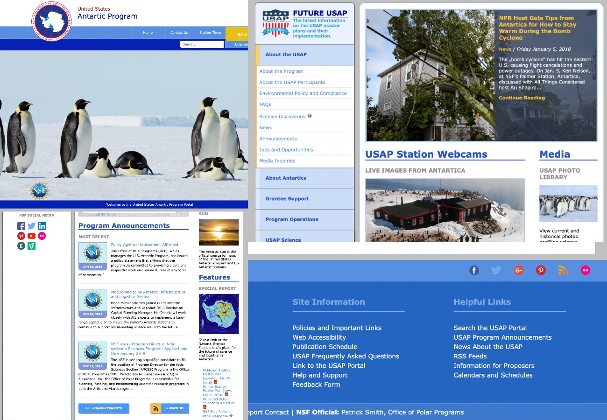

### Example 2

Link to [example](https://github.com/pancogit/html_repo/tree/master/zadaci/float/primer2).

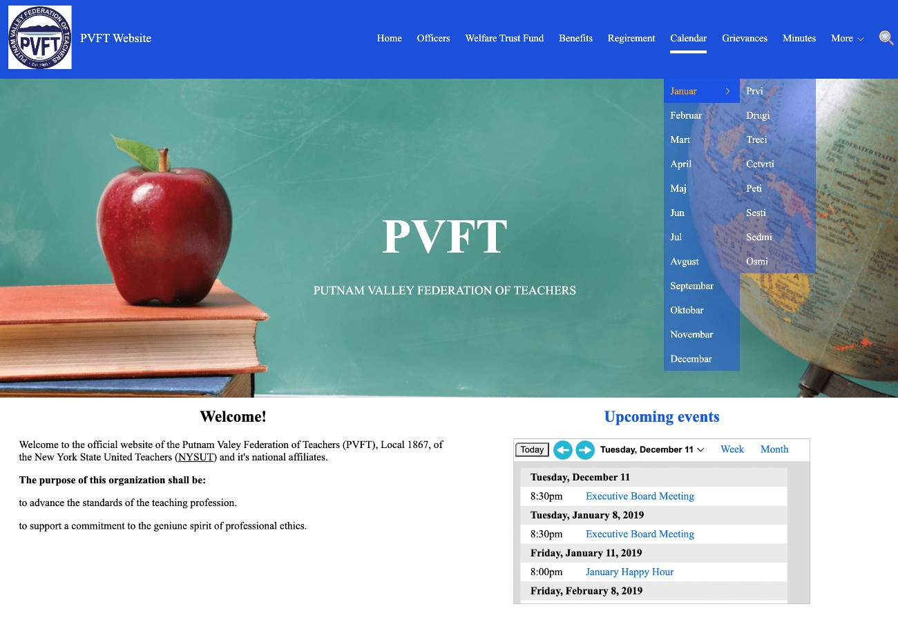

### Example 3

Link to [example](https://github.com/pancogit/html_repo/tree/master/zadaci/float/primer3).

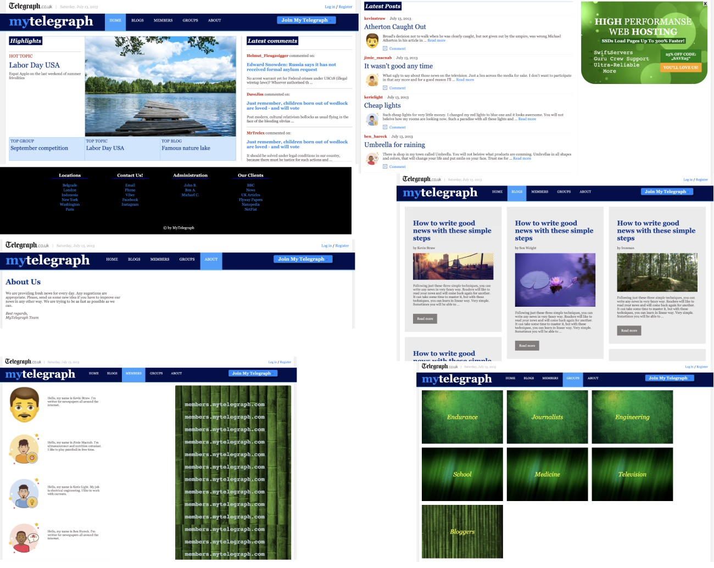

### Example 4

Link to [example](https://github.com/pancogit/html_repo/tree/master/zadaci/float/primer4).

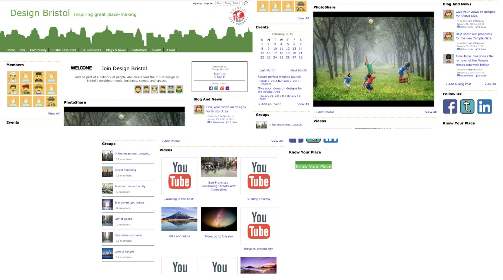

### Example 5

Link to [example](https://github.com/pancogit/html_repo/tree/master/zadaci/float/primer5).

## 2. Flexbox pages

The following examples are using CSS flebox for creating pages.

### Example 6

Link to [example](https://github.com/pancogit/html_repo/tree/master/zadaci/flexbox/primer6).

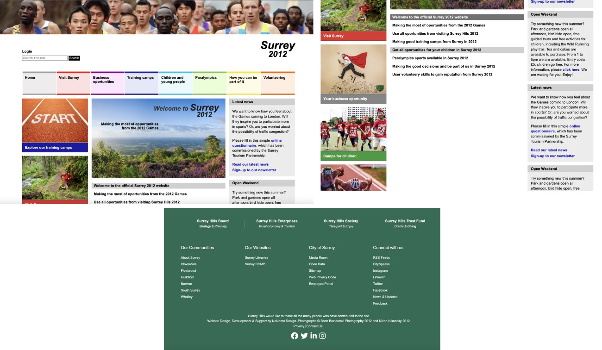

### Example 7

Link to [example](https://github.com/pancogit/html_repo/tree/master/zadaci/flexbox/primer7).

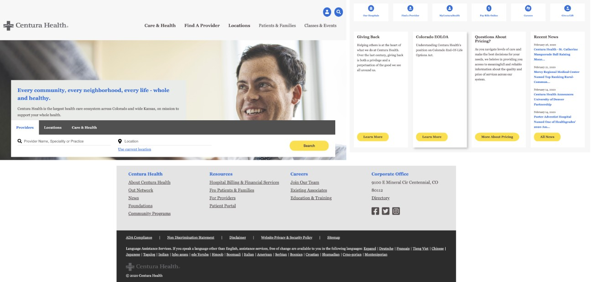

### Example 8

Link to [example](https://github.com/pancogit/html_repo/tree/master/zadaci/flexbox/primer8).

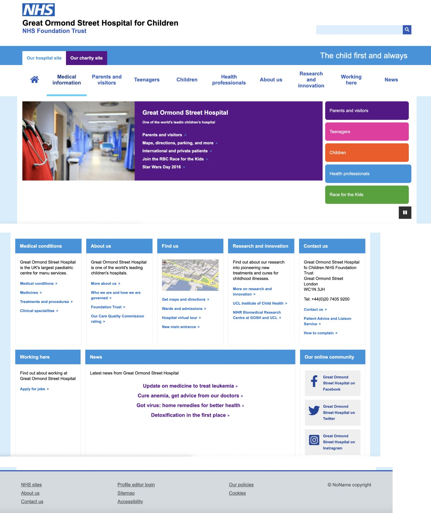

### Example 9

Link to [example](https://github.com/pancogit/html_repo/tree/master/zadaci/flexbox/primer9).

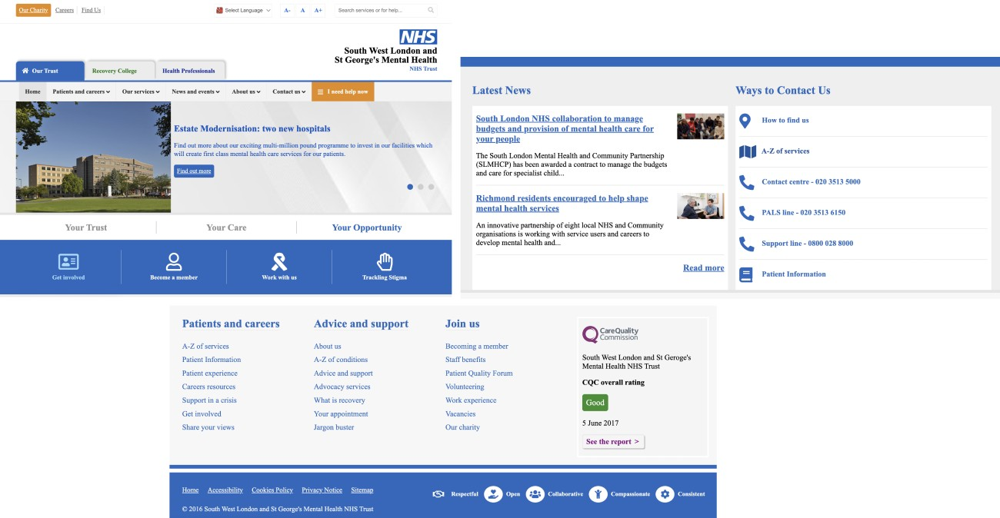

### Example 10

Link to [example](https://github.com/pancogit/html_repo/tree/master/zadaci/flexbox/primer10).

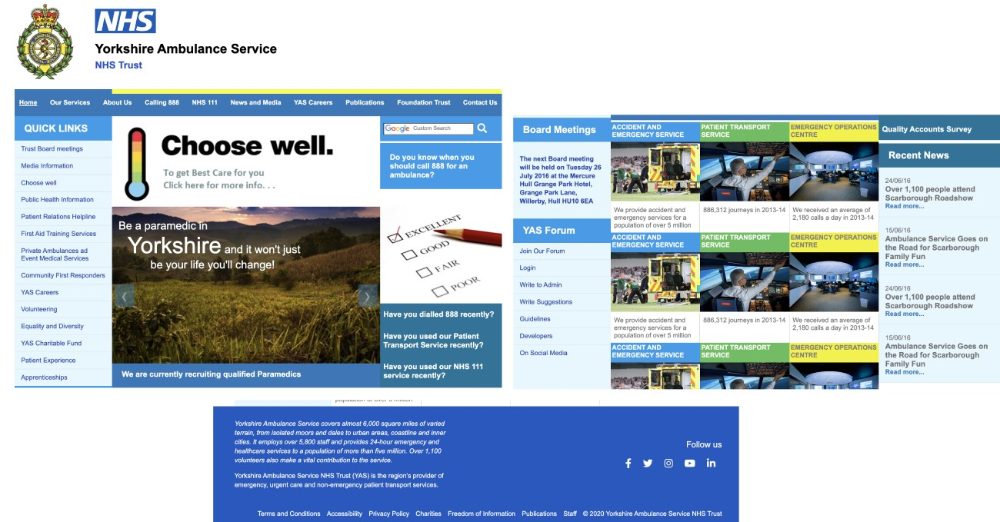

## 3. Grid pages

The following examples are using CSS grid for creating pages.

### Example 11

Link to [example](https://github.com/pancogit/html_repo/tree/master/zadaci/grid/primer11).

### Example 12

Link to [example](https://github.com/pancogit/html_repo/tree/master/zadaci/grid/primer12).

### Example 13

Link to [example](https://github.com/pancogit/html_repo/tree/master/zadaci/grid/primer13).

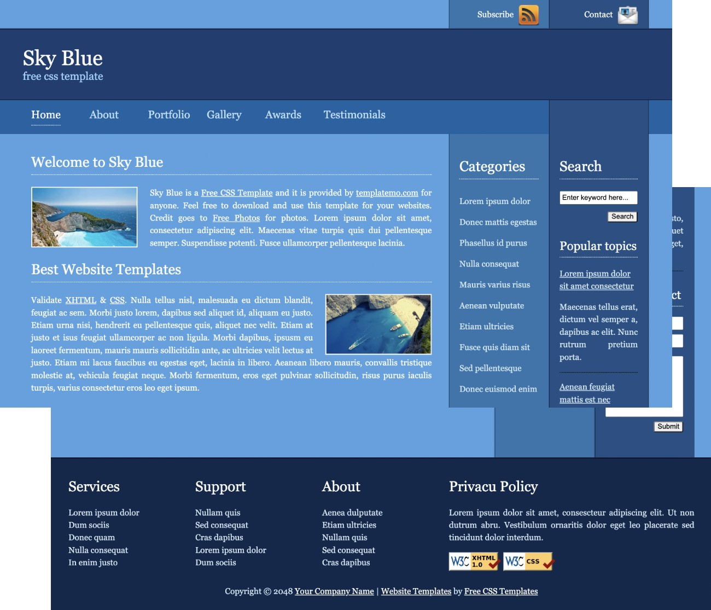

### Example 14

Link to [example](https://github.com/pancogit/html_repo/tree/master/zadaci/grid/primer14).

### Example 15

Link to [example](https://github.com/pancogit/html_repo/tree/master/zadaci/grid/primer15).

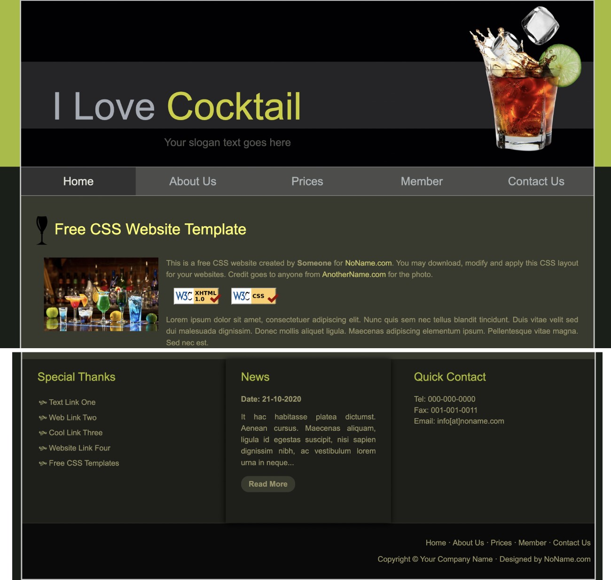

## 4. Bootstrap pages

The following examples are using Bootstrap CSS framework for creating pages.

### Example 16

Link to [example](https://github.com/pancogit/html_repo/tree/master/zadaci/bootstrap/primer16).

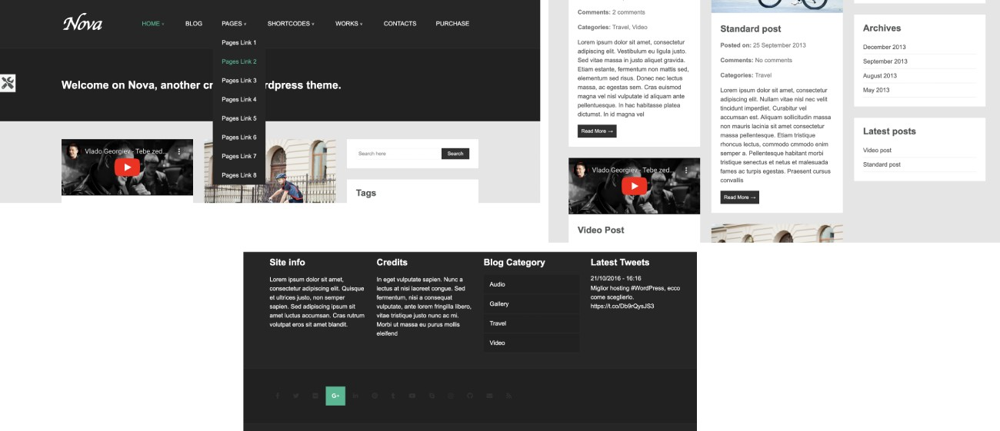

### Example 17

Link to [example](https://github.com/pancogit/html_repo/tree/master/zadaci/bootstrap/primer17).

### Example 18

Link to [example](https://github.com/pancogit/html_repo/tree/master/zadaci/bootstrap/primer18).

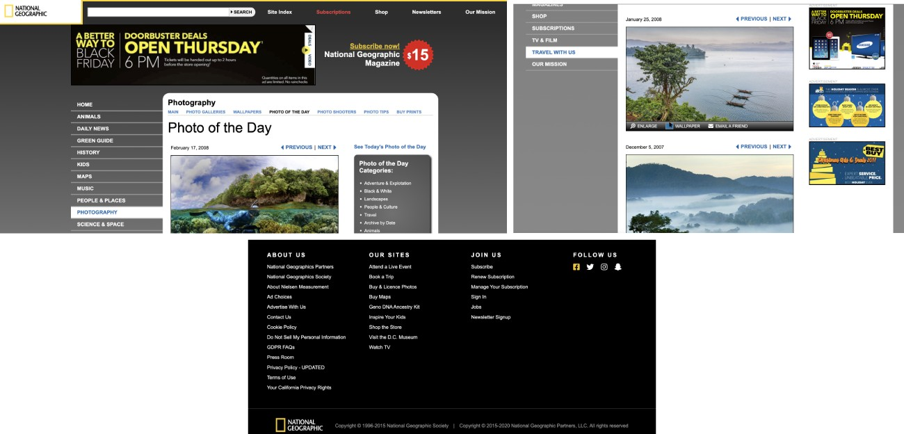

### Example 19

Link to [example](https://github.com/pancogit/html_repo/tree/master/zadaci/bootstrap/primer19).

### Example 20

Link to [example](https://github.com/pancogit/html_repo/tree/master/zadaci/bootstrap/primer20).

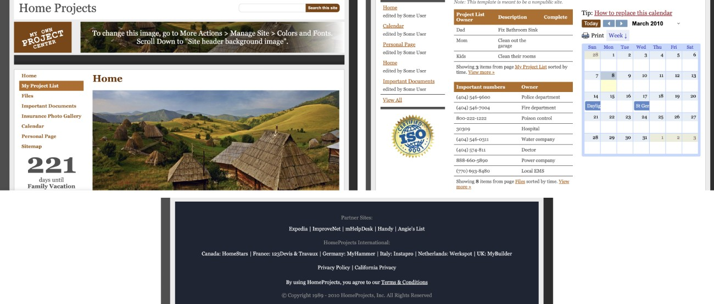

### Example 21

Link to [example](https://github.com/pancogit/html_repo/tree/master/zadaci/bootstrap/primer21).

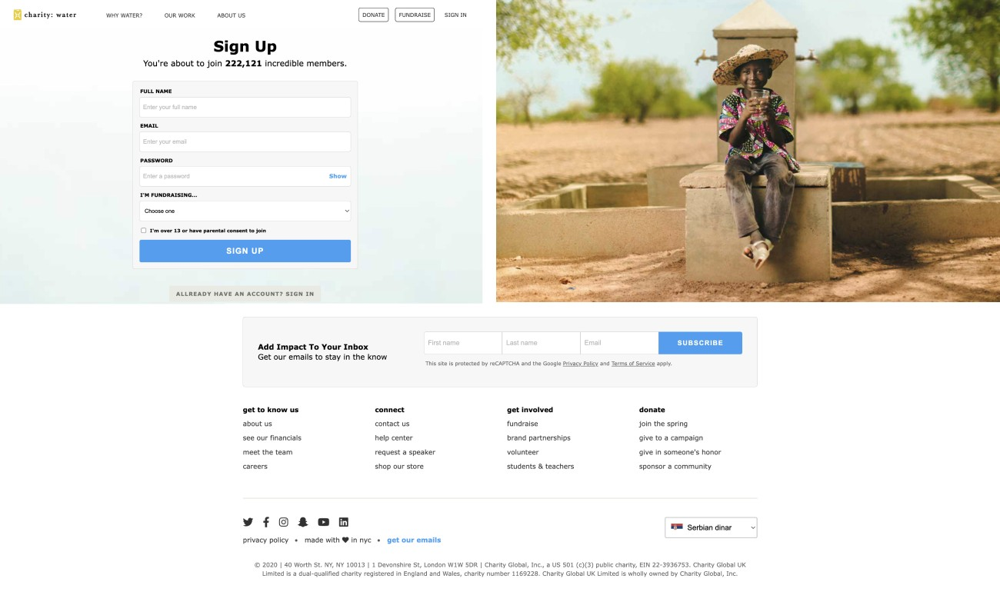

### Example 22

Link to [example](https://github.com/pancogit/html_repo/tree/master/zadaci/bootstrap/primer22).

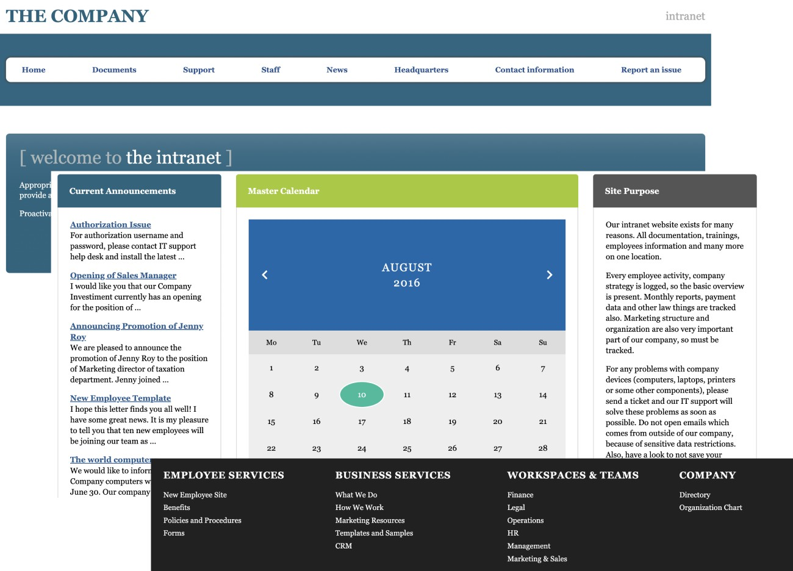
